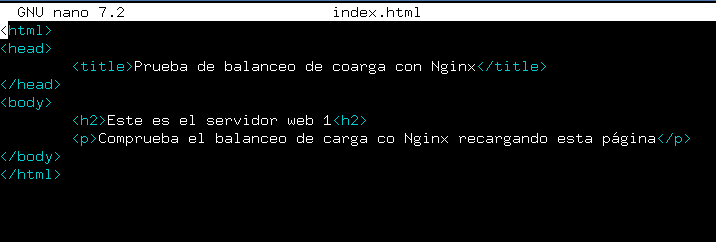
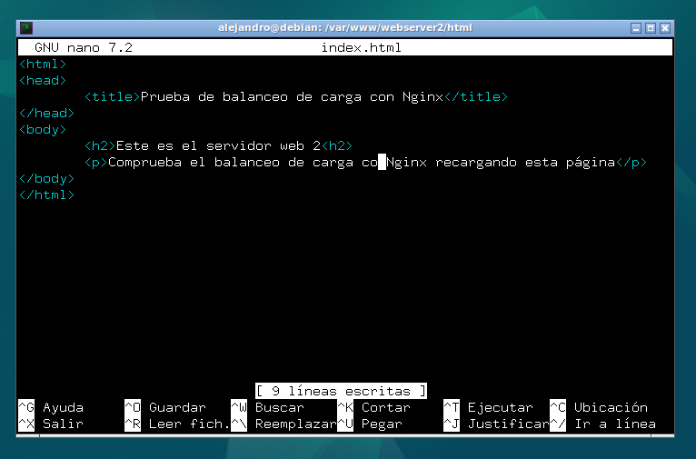
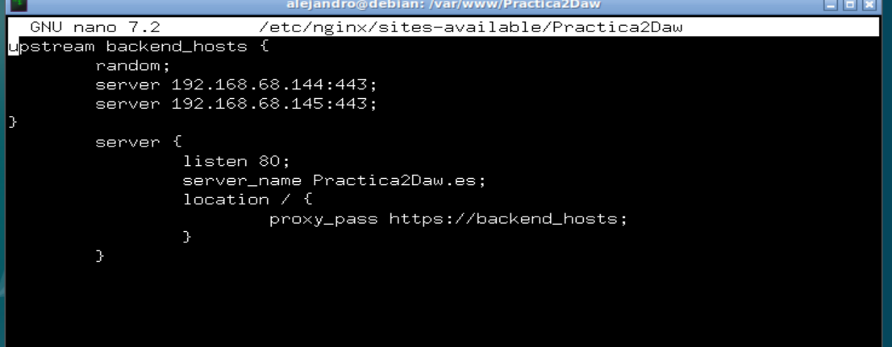

# Practica 2.4 - Proxi Inverso con Blanceo de carga. 
## Introducción 
Los servidores proxy inversos y los balanceadores actúan como intermediarios en la comunicación entre los clientes y los servidores realizando funciones que mejoran la eficiencia. 
Estos dos se ubican entre clientes y servidores, aceptando solicitudes del primero y entregando respuestas del segundo. La implementación del proxy inverso puede ser posible independientemente del número de servidores mientras que el balanceador requiere un mínimo de dos. Este es la cara pública del servidor, se encarga de aceptar solicitudes de los navegadores. 

Los balanceadores con mayor frecuencia se encarga de distribuir peticiones entre varios servidores, ya que serían demasiado volumen de solicitudes para un solo servidor. Esto también hace que en caso de fallo de un servidor, el otro siga siendo funcional. 

## Tarea:
Configurar dos servidores Nginx con dos máquinas Debian, además utilizaremos el proxy inversio configurado en la práctica anterior. 

Como resultado de la pŕactica, al acceder al balanceador, nos irá redirigiendo a los dos servidores configurados. 

### Configuraciones
#### Nginx Servidor web 1. 
Primero deberemos cambiar la configuración de salida. Antes teníamos la de 'static-example' descargada de github. Ahora crearemos un index.html sencillo en la carpeta /var/www/webserver/html que nos dará información de en que servidor estamos en cada momento para confirmar el funcionamiento del balanceador. 
Nos iremos a la carpeta.


Y mediante el comando ** sudo nano index.html** crearemos el archivo y lo editaremos de la siguiente manera. 



En el archivo de configuranción del servidor en el directorio **sites-avaliable** mantendremos la configuración. Escuchará por el puerto 8080 y añadiremos una cabecera que se llame "serv_web1_Alejandro".  Con el siguiente comando. Dentro del bloque location de tu archivo de configuracion. 
```
add header Host serv_web1_Alejandro
```

Al querer mostrar otro index.html que el que estabamos mostrando, también cambiaremos las siguientes líneas del archivo de configuración de vuestro servidor indicando la ruta del index.html. 


Al entrar en el servidor nos mostrará esta página: 


#### Nginx Servidor web 2. 
Esto lo repetiremos con el segundo servidor. 
Para ello habrá que clonarlo, indicaremos que cree nuevas direcciones IP. 
Modificaremos el index.html ubicado en la misma carpeta de la siguiente manera: 



Y le cambiaremos el nombre de webserver a webserver2 en todos los nomnbres que conlleve. 
- Ruta /var/www/webserver 
- Archivo de configuración webserver2
- Dentro del archivo, líneas server_name

No podemos olvidarnos de hacer el link simbólico de sites-enables a sites-avaliable con el siguiente comando : 
```
sudo ln -s /etc/nginx/sites-available/tu-sitio /etc/nginx/sites-enabled/
```

Al listar los elementos de sites-enables nos debe de salir así; 


Al comprobar el servidor nos debe dar la siguiente salida. 


#### Nginx Balanceador.

Cambiaremos el archivo de configuración del que era nuestro proxy anteriormente para hacerlo un balanceador de la siguiente manera : 

 

Bloque upstream backend_hosts:
- Upstream es una directiva que define un grupo de servidores que pueden manejar solicitudes, lo llamamos backend_hosts.
- Random : Estrategia de balanceo de carga que elige al azar uno de los dos servidores. 
- Los servidores disponibles a recibir solicitudes. 

Bloque server:
- Define la configuracion de un servidor virtual en Nginx. 
- Listen 80, especifica que el servidor escucha el puerto 80.
- Dentro de este bloque definimos el bloque location que establece como se manejan las solicitudes para la raíz del servidor.  
- El proxy_pass redirige las solicitudes al grupo de servidores antes definido. 

Tras esta configuración solo quedará la comprobación. 
Utilizando la ip del balanceador : 192.168.68.143  y presionando el F5, nos irá mostrando simultaneamente la salida de cada uno de los servidores. 


## Cuestiones.
### Cuestión 1: 
Busca información de qué otros métodos de balanceo se pueden aplicar con Nginx y describe al menos 3 de ellos.

1. Round Robin: Es el método predeterminado y el mas simple. Distribuye las solicitudes de manera cíclica y uniforme, recibiendo todos un número similar de solicitudes. 
2. Least Connections: Este método asigna la solicitud al servidor con menos conexiones activas, lo que ayuda a mantener el balance si algunos están mas sobrecargados. 
3. IP Hash: Este método asiga las solicitudes en función de la dirección IP del cliente. Esto hace que el mismo usuario solo se conecta a uan IP, clave para mantener la persistencia de sesión. 

### Cuestion 2:
Si quiero añadir 2 servidores web más al balanceo de carga, describe detalladamente qué configuración habría que añadir y dónde.
La solución a esto, es dentro del bloque upstream, le indicamos los dos servidores extras, debajo de los otros dos que ya tenemos, de forma que en vez de repartir entre 2 repartiría las peticiones entre 4. Quedaría de tal forma. 
```
    upstream backend_hosts {
                random;
                server ________:____;
                server ________:____;
                server ________:____;
                server ________:____;
    }
            server {
                listen 80;
                server_name ________;      
                location / {
                    proxy_pass http://backend_hosts;
                }
            }

```
Esa sería la estructura a seguir. 